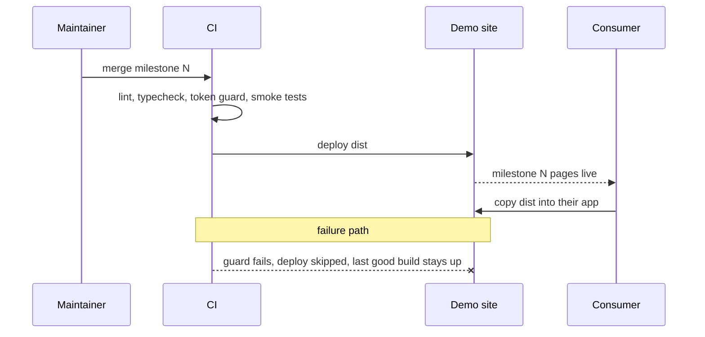
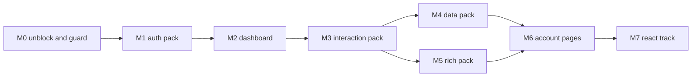

# RFC-001: Completing Clear Admin

|             |               |
| ----------- | ------------- |
| **Version** | v2            |
| **Date**    | 2026-09-11    |
| **Author**  | surdarmaputra |
| **Status**  | Accepted      |
| **Profile** | Frontend only |

### Changelog

| Ver | Date       | Change                                                                                                                              | Verdict                 |
| --- | ---------- | ----------------------------------------------------------------------------------------------------------------------------------- | ----------------------- |
| v1  | 2026-09-11 | initial                                                                                                                             | ⚠️ Feasible with limits |
| v2  | 2026-09-11 | Open questions 2–5 answered. Spreadsheet descoped to cell edit + keyboard nav; M4 10 d → 7 d; total 77 d → 74 d. Status → Accepted. | ⚠️ Feasible with limits |

**v2 diff:** _changed_ — M4 scope and estimate, totals, spreadsheet risk row. _added_ — Alpine-required decision, demo-drift decision. _dropped_ — 4 of 5 open questions.

---

## 1. TL;DR

- Ship the remaining 47 HTML + 53 React items as **7 page-shaped milestones**, HTML track first.
- Each milestone is independently downloadable and usable — nobody waits for the whole set.
- Estimated **~74 eng-days** total (~15 weeks solo at 5 d/wk). Open-ended timeline, progressive delivery.

## 2. Verdict

> ⚠️ **Feasible with limitations** — no technical unknowns; every remaining item is a known pattern on a stack already proven in `main`. The risk is duration, not difficulty.

**Flips if:** a second contributor joins → ✅ (the two bundles parallelise cleanly, since they share no code). Drops to ❌ only if the design system is reopened mid-track, which invalidates finished milestones.

Limitations:

- **~15 weeks solo.** Longest stretch without a shipped milestone is M4 (~7 d), now split into two releases.
- **Two bundles, zero shared code** — by design (see `docs/design-tokens.md`), so every component is genuinely built twice. Cost is doubled and accepted.
- **Token drift is invisible to CI today.** A Tailwind class naming a deleted token compiles to nothing, silently. This already shipped one bug to `main` (`ThemeToggle`, fixed in `6326e6d`).
- **React effort is an estimate, not a measurement.** No React code exists yet; 35 d is extrapolated from HTML velocity and may move ±30%. Deliberately left open — re-estimating before writing React code would be re-guessing, not refining.

## 3. Problem

- **6 of 53** tracked items done in HTML; **0 of 53** in React. 100 items remain.
- Demo advertises two bundles; one card reads "In progress" and links nowhere.
- Deploy is red on `main` — Pages was never enabled, so no demo exists at all.
- **Cost of doing nothing:** the template is unusable. A shell with no components has no consumers.

## 4. Goals / Non-Goals

| Goals                                                        | Non-Goals                                                           |
| ------------------------------------------------------------ | ------------------------------------------------------------------- |
| Every milestone ships a **usable page set**, not loose parts | Vue / Angular / Svelte bundles — HTML and React only                |
| All 53 items in both bundles                                 | npm-published component library — deliverable is a copyable tree    |
| HTML and React stay visually identical                       | Pixel-identical DOM between bundles — same look, different markup   |
| CI catches design-token drift                                | Full visual-regression suite before the component set stabilises    |
| Bundle stays under 250 KB gz per page                        | Supporting IE or pre-2023 Safari                                    |
| Table editing: cell edit + keyboard nav                      | **Excel-grade spreadsheet.** Descoped in v2 — see Decisions         |
| HTML bundle assumes Alpine is present                        | **No-JS fallbacks.** Descoped in v2 — Alpine is a hard prerequisite |

## 5. Decisions

Resolved in v2. Each closes an open question from v1.

| #   | Decision                                                       | Consequence                                                                                                                 |
| --- | -------------------------------------------------------------- | --------------------------------------------------------------------------------------------------------------------------- |
| D1  | **Table editing = cell edit + keyboard nav.** Not Excel-grade. | M4 drops 10 d → 7 d. TanStack Table covers it; AG Grid stays out. Formulas, fill-handle, multi-cell paste are out of scope. |
| D2  | **Alpine is a hard prerequisite** of the HTML bundle.          | No no-JS fallbacks, no progressive-enhancement branches. Documented in README as a requirement.                             |
| D3  | **Demo landing may drift** from `theme.css`.                   | No codegen. It is marketing, not production code. Drift is acceptable and expected.                                         |
| D4  | **Timeline open-ended**, progressive delivery.                 | No date pressure; milestone order is the only commitment.                                                                   |
| D5  | **React estimate stays open** until M7 scaffold.               | 35 d is a placeholder. Re-estimate after 3 d of real React work, not before.                                                |

## 6. Proposed Design

**Slice by page, not by component.** Nobody downloads "Badge" — they download "a login screen". A milestone is done when a consumer can build a real screen with it.

- **Milestone** → a page set + exactly the components those pages need.
- **Track order** → HTML fully, then React. Primary target is server-rendered monoliths; React shares no code, so deferring it costs zero rework.
- **Release** → each milestone merges to `main`, CI deploys, demo grows a working page.

**Stack:** unchanged from `main` — Astro + Alpine + Tailwind v4 (HTML), React 19 + shadcn/Radix + TanStack Router (React).

**Scale assumption:** 53 components × 2 bundles; target ≤250 KB gz per rendered page; current baseline 16 KB CSS + 56 KB JS (20 KB gz).

### Milestones

| #      | Name               | Ships                                | Components pulled in                                                                         | Est.     |
| ------ | ------------------ | ------------------------------------ | -------------------------------------------------------------------------------------------- | -------- |
| **M0** | Unblock + guard    | Live demo; CI catches token drift    | —                                                                                            | 1 d      |
| **M1** | Auth pack          | Login, Register, Password reset, 404 | Input, Textarea, Select, Checkbox, Radio, Card, Badge, Alert, Spinner                        | 5 d      |
| **M2** | Dashboard overview | The flagship screen                  | Stat card, Avatar, 4 charts, basic data table, Pagination, Empty/Error/Loading, Breadcrumb   | 8 d      |
| **M3** | Interaction pack   | CRUD screens buildable               | Dropdown, Tooltip, Modal, Drawer, Tabs, Toast, Switch, Date picker, **focus-trap directive** | 7 d      |
| **M4** | Data pack          | Real admin tables                    | Server-side filter/sort/paginate, resizable columns, cell edit + keyboard nav (D1)           | 7 d      |
| **M5** | Rich pack          | Content and file screens             | Lexical editor, file upload (drag & drop), file preview, image lightbox, Kanban              | 9 d      |
| **M6** | Account pages      | Profile, Settings                    | — (composes M1–M3)                                                                           | 2 d      |
|        | **HTML subtotal**  |                                      |                                                                                              | **39 d** |
| **M7** | React track        | Same 7 milestones, same order        | Scaffold + router + shadcn init (3 d), then M1–M6 equivalents                                | 35 d ?   |

M3 is where the mobile drawer finally gets a focus trap — built once as a reusable Alpine directive that Modal and Drawer both consume, rather than hand-rolled three times.

## 7. Diagrams

### 7.1 Sequence — notice that value reaches the consumer at every milestone, not just at the end

### 7.2 Flowchart — dependency order; only M4 and M5 may run in parallel

## 8. Alternatives

Axes adapted for Frontend profile: infra cost → **bundle size**; blast radius → **which pages break**.

| Axis                | A: Page-shaped milestones | B: Component-shaped, priority order | C: Both bundles in lockstep | Do nothing             |
| ------------------- | ------------------------- | ----------------------------------- | --------------------------- | ---------------------- |
| Build effort        | 74 eng-days               | 74 eng-days                         | 79 eng-days                 | 0                      |
| Ops burden          | Low — solo maintainer     | Low                                 | Med — two tracks at once    | Low                    |
| Bundle size         | ≤250 KB gz/page           | ≤250 KB gz/page                     | ≤250 KB gz/page             | 20 KB gz               |
| Time to first value | **1 week** (M1 auth)      | 6 wk — all P0 before a page exists  | 2 wk                        | never                  |
| Blast radius        | Low — one page set        | Med — partial pages sit broken      | Med — both bundles at once  | —                      |
| Reversibility       | Easy                      | Easy                                | Hard — rework doubles       | Easy                   |
| a11y impact         | Focus trap lands M3       | Focus trap lands late               | Focus trap twice            | Drawer stays untrapped |
| **Score → Pick**    | **✅ Winner**             |                                     |                             |                        |

Why the losers lost:

- **B** — finishing all 16 P0 items yields zero usable screens; the first shippable page arrives ~6 weeks in.
- **C** — porting a design to React before it has survived contact with real HTML pages means paying for every change twice.
- **Do nothing** — genuinely cheap, and genuinely worthless: the repo has a shell and no components.

## 9. Risks & Mitigations

| Risk                                                  | Likelihood | Impact | Mitigation                                                                                         |
| ----------------------------------------------------- | ---------- | ------ | -------------------------------------------------------------------------------------------------- |
| Design token renamed; stale class compiles to nothing | **High**   | Med    | M0 token guard: scan source classes against `@theme` names, fail CI. Already bit us once.          |
| Design reopened mid-track, invalidating finished work | Med        | High   | Freeze `docs/design-tokens.md` after M2. Changes after that are a new RFC version, not a tweak.    |
| HTML/React visual drift                               | Med        | Med    | Shared class contract per component; add visual regression at M7 start, once HTML has stabilised.  |
| Solo maintainer stalls mid-milestone                  | Med        | Med    | M4 splits into two releases (4a server-side table, 4b cell editing) so nothing sits unshipped 7 d. |
| Consumer omits Alpine and the bundle appears broken   | **High**   | Low    | D2 makes Alpine a documented hard requirement in the README, not an inference.                     |
| Bundle bloat once charts + editor + kanban land       | Med        | Med    | Per-page JS budget in CI; Alpine components load per page, not globally.                           |
| Nobody is paged — this is a template, not a service   | —          | —      | No on-call. Failure mode is a red CI run, not an outage.                                           |

## 10. Cost

| Item             | Amount        | Notes                                        |
| ---------------- | ------------- | -------------------------------------------- |
| Infra            | **$0/mo**     | GitHub Pages, free tier; no runtime services |
| Bundle budget    | ≤250 KB gz    | per rendered page; baseline today 20 KB gz   |
| Eng effort HTML  | 39 d          | estimate from observed velocity              |
| Eng effort React | 35 d ?        | extrapolated — no React code exists yet      |
| Ongoing ops      | ~0 hrs/wk     | static site; CI only runs on push            |
| **Total y1**     | **~74 d, $0** | solo ≈ 15 weeks                              |

## 11. Rollout

Every phase exits with a deployed demo. Rollback is always `git revert` + redeploy — no state, no migrations.

| Phase | Does                                | Exit criteria                                                            | Rollback               |
| ----- | ----------------------------------- | ------------------------------------------------------------------------ | ---------------------- |
| M0    | Enable Pages; add token guard to CI | Demo reachable; guard fails on a deliberately broken token               | revert workflow commit |
| M1    | Auth pack                           | 4 auth pages live and copyable; smoke tests green                        | `git revert`, redeploy |
| M2    | Dashboard overview                  | Flagship screen live; charts validated against palette in both themes    | `git revert`, redeploy |
| M3    | Interaction pack                    | Focus trap verified by keyboard test; Modal/Drawer/mobile nav all use it | `git revert`, redeploy |
| M4a   | Server-side data table              | Sort/filter/paginate against a mock endpoint                             | `git revert`, redeploy |
| M4b   | Cell edit + keyboard nav (D1)       | Arrow-key cell traversal, enter to edit, escape to cancel                | `git revert`, redeploy |
| M5    | Rich pack                           | Editor, file ops, kanban live                                            | `git revert`, redeploy |
| M6    | Account pages                       | HTML bundle **100% complete**; tracker all `done`                        | `git revert`, redeploy |
| M7    | React track, M1–M6 order            | React card on demo goes live; both bundles at parity                     | `git revert`, redeploy |

**Cheapest kill test:** M0 + M1 is 6 days. If the auth pack is not genuinely drop-in for a Blade app after that, the two-bundle premise is wrong and the rest of the plan should be rewritten before spending the other 68 days.

## 12. Measurement

_N/A — not a Growth profile. Progress is tracked in `docs/components.md`; CI green plus a live demo page is the only signal needed._

## 13. Monetization

_N/A — MIT licensed, no revenue model. Revisit only if a paid tier is proposed._

## 14. Open Questions

| #   | Question                                                                   | Owner         | Needed by |
| --- | -------------------------------------------------------------------------- | ------------- | --------- |
| 1   | React effort is extrapolated, not measured. Re-estimate after M7 scaffold. | surdarmaputra | M7 start  |

_v1 questions 2–5 resolved — see § 5 Decisions._

## 15. Recommendation

- **Do:** M0 now — enable Pages, add the token guard. One day, and it protects the other 73.
- **Don't:** start React before M6. Porting an unproven design costs every change twice.
- **Revisit when:** M1 ships and the auth pack meets a real Blade app — that is the moment the two-bundle premise is either confirmed or dead.
