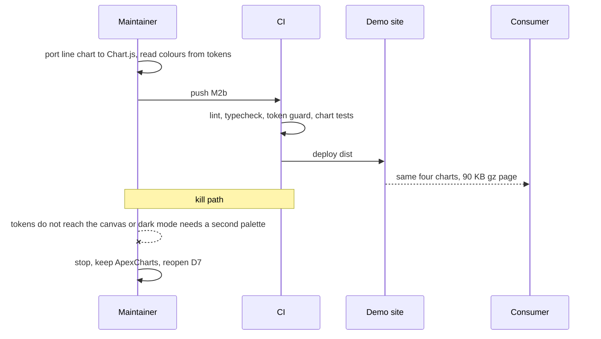
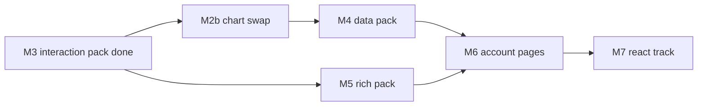

# RFC-001: Completing Clear Admin

|             |               |
| ----------- | ------------- |
| **Version** | v3            |
| **Date**    | 2026-09-12    |
| **Author**  | surdarmaputra |
| **Status**  | Accepted      |
| **Profile** | Frontend only |

### Changelog

| Ver | Date       | Change                                                                                                                                                               | Verdict                 |
| --- | ---------- | -------------------------------------------------------------------------------------------------------------------------------------------------------------------- | ----------------------- |
| v1  | 2026-09-11 | initial                                                                                                                                                              | ⚠️ Feasible with limits |
| v2  | 2026-09-11 | Open questions 2–5 answered. Spreadsheet descoped to cell edit + keyboard nav; M4 10 d → 7 d; total 77 d → 74 d. Status → Accepted.                                  | ⚠️ Feasible with limits |
| v3  | 2026-09-12 | Records the elevation reversal shipped in #3, re-freezes tokens after M3, marks M0–M3 done, and resolves the bundle-budget breach by swapping ApexCharts → Chart.js. | ⚠️ Feasible with limits |

**v3 diff:** _changed_ — milestone table now carries status; token freeze moves M2 → M3; remaining effort 74 d → 55 d. _added_ — D6 elevation reversal, D7 chart library swap, milestone M2b (2 d), chart-port risks. _dropped_ — the "bundle bloat once charts land" risk row, now a decision rather than a risk.

---

## 1. TL;DR

- **M0–M3 shipped** — 21 of 39 HTML eng-days done; 35 of 53 HTML items `done` in the tracker.
- **The chart library is the budget.** ApexCharts is 270 KB gz measured; the four dashboard charts need 64.5 KB gz on Chart.js. Swap it (M2b, 2 d) and the ≤250 KB gz per-page budget holds without redefining it.
- Remaining: **~55 eng-days** (2 d chart swap + 16 d HTML + 35 d React `?`).

## 2. Verdict

> ⚠️ **Feasible with limitations** — unchanged from v2. Three milestones have shipped on the estimates in this document, which is the first real evidence the plan holds. The risk is still duration, not difficulty.

**Flips if:** a second contributor joins → ✅. Drops to ❌ only if the design system is reopened again mid-track — see D6 for the one time it already was.

Limitations:

- **~11 weeks solo remaining** at 5 d/wk, React included.
- **Two bundles, zero shared code** — by design. Every component is built twice.
- **React effort is still an estimate, not a measurement.** 35 d, unchanged since v1, re-estimated at the M7 scaffold and not before.
- **The chart swap is rework**, paid because the library exceeded the budget by itself. 2 d.

## 3. Problem

v2's problem statement is resolved in part:

| v2 said                                          | Today                                                                   |
| ------------------------------------------------ | ----------------------------------------------------------------------- |
| 6 of 53 HTML items done, 0 of 53 React           | 35 of 53 HTML, still 0 React                                            |
| Demo advertises two bundles, one links nowhere   | Unchanged — the React card is still "In progress"                       |
| Deploy is red on `main`, Pages was never enabled | Fixed. Pages deploys from `main`, demo is live                          |
| —                                                | **New:** the dashboard ships 296 KB gz against a 250 KB gz budget       |
| —                                                | **New:** `docs/design-tokens.md` was rewritten mid-track without an RFC |

## 4. Goals / Non-Goals

Unchanged from v2, with one addition:

| Goals                                             | Non-Goals                                                        |
| ------------------------------------------------- | ---------------------------------------------------------------- |
| Every milestone ships a **usable page set**       | Vue / Angular / Svelte bundles                                   |
| All 53 items in both bundles                      | npm-published component library                                  |
| HTML and React stay visually identical            | Pixel-identical DOM between bundles                              |
| CI catches design-token drift                     | Full visual-regression suite before the component set stabilises |
| **Every page under 250 KB gz, total transferred** | Redefining the budget as first-paint payload — see D7            |
| Table editing: cell edit + keyboard nav           | Excel-grade spreadsheet (D1)                                     |
| HTML bundle assumes Alpine is present             | No-JS fallbacks (D2)                                             |

## 5. Decisions

D1–D5 stand as written in v2. v3 adds three.

| #      | Decision                                                                                                                     | Consequence                                                                                                                                                                       |
| ------ | ---------------------------------------------------------------------------------------------------------------------------- | --------------------------------------------------------------------------------------------------------------------------------------------------------------------------------- |
| **D6** | **Resting surfaces may carry a shadow.** The original "focus ring is the only shadow" rule is withdrawn.                     | Two ambient shadow tokens (`--shadow-card`, `--shadow-raised`), dark mode gets its own neutral steps. Already shipped in #3; this version is the record the risk table asked for. |
| **D7** | **Chart library: ApexCharts → Chart.js v4**, tree-shaken to the four controllers the dashboard draws.                        | −205 KB gz on every page with a chart. The budget stays "total transferred per page" and is met on the measurement, not on a reinterpretation. Costs 2 d as M2b.                  |
| **D8** | **Tokens freeze after M3, not M2.** M3 added no tokens; the freeze simply starts from the design that survived the reversal. | Any token change from here is a v4 of this RFC, not an edit. The reversal in D6 is the precedent for why that matters.                                                            |

**Why D6 is recorded rather than reverted:** a dashboard of stacked cards read flat with hairlines alone. The shadows shipped, were reviewed, and are in `main` — writing the rule back into the doc and leaving the code contradicting it is the worse of the two failures. v2's risk table demanded a new version for exactly this; this is it.

## 6. Proposed Design

Unchanged: **slice by page, not by component.** HTML fully, then React.

**Stack — one change:** Astro + Alpine + Tailwind v4 (HTML), React 19 + shadcn/Radix + TanStack Router (React). Charts move from ApexCharts to **Chart.js v4** in the HTML bundle. `docs/components.md` and `README.md` carry the same table and change with it.

### Milestones

| #       | Name               | Ships                                | Est.     | Status                                |
| ------- | ------------------ | ------------------------------------ | -------- | ------------------------------------- |
| **M0**  | Unblock + guard    | Live demo; CI catches token drift    | 1 d      | ✅ done — `224f94d`                   |
| **M1**  | Auth pack          | Login, Register, Password reset, 404 | 5 d      | ✅ done — `224f94d`                   |
| **M2**  | Dashboard overview | The flagship screen                  | 8 d      | ✅ done — `224f94d`                   |
| **M3**  | Interaction pack   | CRUD screens buildable               | 7 d      | ✅ done — `ddd30a5`                   |
| **M2b** | Chart swap (D7)    | Same four charts, 205 KB gz lighter  | 2 d      | next                                  |
| **M4**  | Data pack          | Real admin tables                    | 7 d      | 4a server-side, 4b cell edit          |
| **M5**  | Rich pack          | Content and file screens             | 9 d      | may run parallel with M4              |
| **M6**  | Account pages      | Profile, Settings                    | 2 d      | composes M1–M3                        |
|         | **HTML remaining** |                                      | **20 d** |                                       |
| **M7**  | React track        | Same milestones, same order          | 35 d ?   | scaffold re-estimates before the rest |

M2b is deliberately small and ahead of M4: the four charts exist and are covered by tests, so the port is measurable in a day and provable in two. Doing it after M5 means porting charts that M5 pages have already copied.

### Page budget after M2b

| Page                | Today     | After M2b |
| ------------------- | --------- | --------- |
| Dashboard           | 296 KB gz | 90 KB gz  |
| Auth / forms / 404  | 20 KB gz  | 20 KB gz  |
| Overlays / feedback | 20 KB gz  | 20 KB gz  |

Measured with `gzip -9` on the built `dist/` assets, not estimated.

## 7. Diagrams

### 7.1 Sequence — the chart swap, and the one check that decides it

Notice the kill path costs one day, not two.

### 7.2 Flowchart — what is left, and what unblocks what

M2b sits on the M4 path, not the M5 one — M5 pages carry no charts.

## 8. Alternatives

Candidates for D7, measured the same way: one esbuild bundle importing only what the four dashboard charts need, minified, `gzip -9`.

| Axis                | A: Chart.js v4 | B: uPlot          | C: Frappe Charts | Do nothing (ApexCharts) |
| ------------------- | -------------- | ----------------- | ---------------- | ----------------------- |
| Build effort        | 2 eng-days     | 4 eng-days        | 3 eng-days       | 0                       |
| Ops burden          | Low            | Low               | Med — thin docs  | Low                     |
| Bundle size         | **64.5 KB gz** | 22.5 KB gz        | 18.2 KB gz       | 270 KB gz               |
| Time to first value | 2 d            | 4 d               | 3 d              | shipped                 |
| Blast radius        | Low — one page | Low               | Low              | —                       |
| Reversibility       | Easy           | Easy              | Easy             | Easy                    |
| Licence             | MIT            | MIT               | MIT              | MIT                     |
| Covers all 4 types  | **yes**        | no — no donut/pie | yes, weaker API  | yes                     |
| **Score → Pick**    | **✅ Winner**  |                   |                  |                         |

Why the losers lost:

- **B (uPlot)** — 42 KB gz cheaper and genuinely faster, but it is a time-series plotter: the donut would be hand-rolled SVG, and the saving buys nothing once the page is already at 90 KB gz against a 250 KB gz budget.
- **C (Frappe Charts)** — smallest of the three, but the API gives least control over the axis and tooltip work already shipped in M2, and the port would re-litigate decisions that are done.
- **Do nothing** — the only option that breaks a stated goal. 270 KB gz for a chart library is 108% of the entire page budget on its own.

## 9. Risks & Mitigations

| Risk                                                 | Likelihood | Impact | Mitigation                                                                                                                                          |
| ---------------------------------------------------- | ---------- | ------ | --------------------------------------------------------------------------------------------------------------------------------------------------- |
| Chart port loses behaviour the M2 tests do not cover | Med        | Med    | The four tests assert themed stroke colours, re-theme on toggle, and fit-inside-card. Port behind them, rewriting only the Apex-specific selectors. |
| Dark palette regresses during the port               | Med        | Med    | Re-run the CVD and contrast checks on both palettes before merge — same gate M2 passed.                                                             |
| Compact axis labels and tooltip precision drift      | Med        | Low    | Both are formatter callbacks in Chart.js too. Verified at 390 px before merge.                                                                      |
| Design reopened again mid-track                      | Low        | High   | D8 — tokens are frozen from M3. A change is a v4, and D6 is the precedent for what a silent edit costs.                                             |
| Token renamed; stale class compiles to nothing       | Low        | Med    | M0 token guard runs in CI and has caught it once since.                                                                                             |
| Solo maintainer stalls mid-milestone                 | Med        | Med    | Nothing left is longer than 9 d, and M4 still splits into 4a and 4b.                                                                                |
| HTML/React visual drift                              | Med        | Med    | Shared class contract per component; visual regression added at M7 start.                                                                           |
| React chart library repeats the ApexCharts mistake   | Med        | Med    | Measure before adopting. Recharts with its React runtime bundles to 70.5 KB gz on the same test — acceptable, confirm at M7.                        |
| Nobody is paged — this is a template, not a service  | —          | —      | No on-call. Failure mode is a red CI run, not an outage.                                                                                            |

## 10. Cost

| Item             | Amount        | Notes                                                     |
| ---------------- | ------------- | --------------------------------------------------------- |
| Infra            | **$0/mo**     | GitHub Pages, free tier                                   |
| Licences         | **$0**        | Every dependency in the stack is MIT                      |
| Bundle budget    | ≤250 KB gz    | per page, total transferred; dashboard 90 KB gz after M2b |
| Eng effort HTML  | 20 d          | 2 d M2b + 18 d M4–M6                                      |
| Eng effort React | 35 d ?        | extrapolated — no React code exists yet                   |
| Spent to date    | 21 d          | M0–M3, on estimate                                        |
| **Total y1**     | **~76 d, $0** | 74 d planned + 2 d rework                                 |

## 11. Rollout

Unchanged mechanics: every phase exits with a deployed demo, rollback is always `git revert` + redeploy.

| Phase | Does                              | Exit criteria                                                             | Rollback         |
| ----- | --------------------------------- | ------------------------------------------------------------------------- | ---------------- |
| M0–M3 | Shipped                           | Demo live; 35 of 53 HTML items `done`                                     | —                |
| M2b   | Port four charts to Chart.js (D7) | Dashboard ≤100 KB gz; both palettes pass CVD and contrast; M2 tests green | revert, redeploy |
| M4a   | Server-side data table            | Sort/filter/paginate against a mock endpoint                              | revert, redeploy |
| M4b   | Cell edit + keyboard nav (D1)     | Arrow-key traversal, enter to edit, escape to cancel                      | revert, redeploy |
| M5    | Rich pack                         | Editor, file ops, kanban live                                             | revert, redeploy |
| M6    | Account pages                     | HTML bundle **100% complete**; tracker all `done`                         | revert, redeploy |
| M7    | React track, M1–M6 order          | React card on demo goes live; both bundles at parity                      | revert, redeploy |

**Cheapest kill test for D7:** port the line chart alone, 1 day. If the tokens do not reach the canvas or dark mode needs a second hand-tuned palette, stop and keep ApexCharts behind its dynamic import.

## 12. Measurement

_N/A — not a Growth profile. Progress is `docs/components.md`; CI green plus a live demo page is the only signal needed. The one number tracked here is the per-page gz budget in §6._

## 13. Monetization

_N/A — MIT licensed, no revenue model._

## 14. Open Questions

| #   | Question                                                                                                           | Owner         | Needed by |
| --- | ------------------------------------------------------------------------------------------------------------------ | ------------- | --------- |
| 1   | React effort is extrapolated, not measured. Re-estimate after the M7 scaffold.                                     | surdarmaputra | M7 start  |
| 2   | React chart library — Recharts measures 70.5 KB gz with its runtime. Confirm or swap before porting the dashboard. | surdarmaputra | M7 charts |

## 15. Recommendation

- **Do:** M2b next — 2 days removes 205 KB gz from every chart page and settles a stated goal that is currently unmet.
- **Then:** M4, per the dependency order. It is the last milestone with unproven scope, since 4b's editing model is new work rather than a known pattern.
- **Don't:** start React before M6.
- **Revisit when:** the M7 scaffold lands and the 35 d estimate meets real code.
