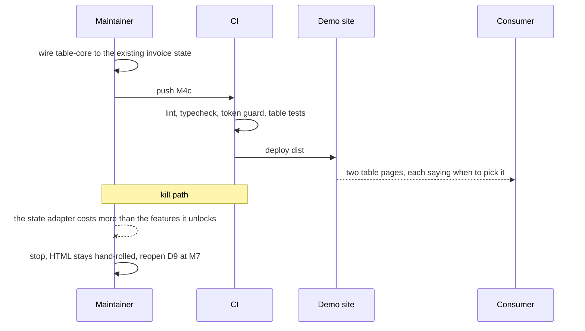
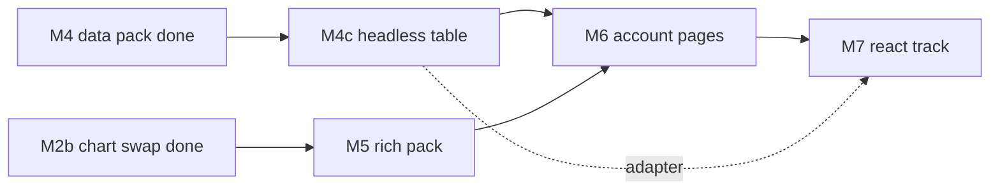

# RFC-001: Completing Clear Admin

|             |               |
| ----------- | ------------- |
| **Version** | v4            |
| **Date**    | 2026-09-12    |
| **Author**  | surdarmaputra |
| **Status**  | Accepted      |
| **Profile** | Frontend only |

### Changelog

| Ver | Date       | Change                                                                                                                                                               | Verdict                 |
| --- | ---------- | -------------------------------------------------------------------------------------------------------------------------------------------------------------------- | ----------------------- |
| v1  | 2026-09-11 | initial                                                                                                                                                              | ⚠️ Feasible with limits |
| v2  | 2026-09-11 | Open questions 2–5 answered. Spreadsheet descoped to cell edit + keyboard nav; M4 10 d → 7 d; total 77 d → 74 d. Status → Accepted.                                  | ⚠️ Feasible with limits |
| v3  | 2026-09-12 | Records the elevation reversal shipped in #3, re-freezes tokens after M3, marks M0–M3 done, and resolves the bundle-budget breach by swapping ApexCharts → Chart.js. | ⚠️ Feasible with limits |
| v4  | 2026-09-12 | M2b and M4 shipped; budget now measured rather than projected. Adds a second, headless table implementation (M4c) and the rule that keeps the two from diverging.    | ⚠️ Feasible with limits |

**v4 diff:** _changed_ — milestone statuses through M4; page budget table replaced with browser measurements; remaining effort 55 d → 48 d. _added_ — D9 two table implementations and the reference rule, milestone M4c (2 d), a divergence risk row. _dropped_ — the projected "after M2b" column, superseded by the measurement.

---

## 1. TL;DR

- **M0–M4 and M2b shipped** — 30 eng-days done; 39 of 53 HTML items `done` in the tracker.
- **The budget is met, and now measured** — the dashboard transfers 101.6 KB gz against a 250 KB gz ceiling, down from roughly 310 KB gz on ApexCharts.
- **Two table implementations, not one** (D9): the Alpine table stays the reference, a headless TanStack page shows what the core buys. 2 d, and it de-risks the React track.
- Remaining: **~48 eng-days** (13 d HTML + 35 d React `?`).

## 2. Verdict

> ⚠️ **Feasible with limitations** — unchanged. Six milestones have now shipped on the estimates in this document, including the 2 d chart swap and the 7 d data pack. The risk is still duration, not difficulty.

**Flips if:** a second contributor joins → ✅. Drops to ❌ only if the design system is reopened again mid-track — see D6 for the one time it already was.

Limitations:

- **~10 weeks solo remaining** at 5 d/wk, React included.
- **Two bundles, zero shared code** — by design. Every component is built twice.
- **React effort is still an estimate, not a measurement.** 35 d, unchanged since v1, re-estimated at the M7 scaffold and not before.
- **The chart swap was rework**, paid because the library exceeded the budget by itself. 2 d, spent.
- **Two table implementations now exist**, so every future table feature is a judgement call about where it lands. D9 sets the rule; it is still a standing cost.

## 3. Problem

v2's problem statement is resolved in part:

| v2 said                                          | Today                                                           |
| ------------------------------------------------ | --------------------------------------------------------------- |
| 6 of 53 HTML items done, 0 of 53 React           | 39 of 53 HTML, still 0 React                                    |
| Demo advertises two bundles, one links nowhere   | Unchanged — the React card is still "In progress"               |
| Deploy is red on `main`, Pages was never enabled | Fixed. Pages deploys from `main`, demo is live                  |
| v3: dashboard over the 250 KB gz budget          | Fixed in M2b. 101.6 KB gz measured in a browser                 |
| v3: tokens rewritten mid-track without an RFC    | Recorded as D6; tokens frozen from M3 under D8                  |
| —                                                | **New:** consumers have no way to compare table approaches (D9) |

## 4. Goals / Non-Goals

Unchanged from v2, with one addition:

| Goals                                             | Non-Goals                                                        |
| ------------------------------------------------- | ---------------------------------------------------------------- |
| Every milestone ships a **usable page set**       | Vue / Angular / Svelte bundles                                   |
| All 53 items in both bundles                      | npm-published component library                                  |
| HTML and React stay visually identical            | Pixel-identical DOM between bundles                              |
| CI catches design-token drift                     | Full visual-regression suite before the component set stabilises |
| **Every page under 250 KB gz, total transferred** | Redefining the budget as first-paint payload — see D7            |
| Table editing: cell edit + keyboard nav           | Excel-grade spreadsheet (D1)                                     |
| HTML bundle assumes Alpine is present             | No-JS fallbacks (D2)                                             |

## 5. Decisions

D1–D5 stand as written in v2, D6–D8 as written in v3. v4 adds one.

| #      | Decision                                                                                                                     | Consequence                                                                                                                                                                       |
| ------ | ---------------------------------------------------------------------------------------------------------------------------- | --------------------------------------------------------------------------------------------------------------------------------------------------------------------------------- |
| **D6** | **Resting surfaces may carry a shadow.** The original "focus ring is the only shadow" rule is withdrawn.                     | Two ambient shadow tokens (`--shadow-card`, `--shadow-raised`), dark mode gets its own neutral steps. Already shipped in #3; this version is the record the risk table asked for. |
| **D7** | **Chart library: ApexCharts → Chart.js v4**, tree-shaken to the four controllers the dashboard draws.                        | −205 KB gz on every page with a chart. The budget stays "total transferred per page" and is met on the measurement, not on a reinterpretation. Costs 2 d as M2b.                  |
| **D8** | **Tokens freeze after M3, not M2.** M3 added no tokens; the freeze simply starts from the design that survived the reversal. | Any token change from here is a v4 of this RFC, not an edit. The reversal in D6 is the precedent for why that matters.                                                            |

| **D9** | **Ship two table implementations.** The hand-rolled Alpine table is the reference; a second page demonstrates the same screen on `@tanstack/table-core`. | Consumers pick an approach instead of inheriting one, and the Alpine↔headless adapter is written at M4 cost rather than being discovered at M7, where the React bundle already commits to `@tanstack/react-table`. Costs 2 d as M4c. |

**The rule that keeps D9 from doubling every future table task:** the Alpine table is the reference implementation and gets every feature. The headless page only tracks features the core makes materially easier — faceted filters, column visibility, ordering, pinning, grouping. A feature that would be the same code twice belongs on the reference page alone. Two pages that behave identically teach a consumer nothing and cost maintenance forever; the headless page earns its place only by doing what the hand-rolled one cannot justify.

**Why D6 is recorded rather than reverted:** a dashboard of stacked cards read flat with hairlines alone. The shadows shipped, were reviewed, and are in `main` — writing the rule back into the doc and leaving the code contradicting it is the worse of the two failures. v2's risk table demanded a new version for exactly this; this is it.

## 6. Proposed Design

Unchanged: **slice by page, not by component.** HTML fully, then React.

**Stack — one change:** Astro + Alpine + Tailwind v4 (HTML), React 19 + shadcn/Radix + TanStack Router (React). Charts move from ApexCharts to **Chart.js v4** in the HTML bundle. `docs/components.md` and `README.md` carry the same table and change with it.

### Milestones

| #       | Name                | Ships                                 | Est.     | Status                                |
| ------- | ------------------- | ------------------------------------- | -------- | ------------------------------------- |
| **M0**  | Unblock + guard     | Live demo; CI catches token drift     | 1 d      | ✅ done — `224f94d`                   |
| **M1**  | Auth pack           | Login, Register, Password reset, 404  | 5 d      | ✅ done — `224f94d`                   |
| **M2**  | Dashboard overview  | The flagship screen                   | 8 d      | ✅ done — `224f94d`                   |
| **M3**  | Interaction pack    | CRUD screens buildable                | 7 d      | ✅ done — `ddd30a5`                   |
| **M4**  | Data pack           | Real admin tables                     | 7 d      | ✅ done — `e8a895d`                   |
| **M2b** | Chart swap (D7)     | Same four charts, 205 KB gz lighter   | 2 d      | ✅ done — `7edab46`                   |
| **M4c** | Headless table (D9) | Same screen on `@tanstack/table-core` | 2 d      | next                                  |
| **M5**  | Rich pack           | Content and file screens              | 9 d      | may run parallel with M4c             |
| **M6**  | Account pages       | Profile, Settings                     | 2 d      | composes M1–M3                        |
|         | **HTML remaining**  |                                       | **13 d** |                                       |
| **M7**  | React track         | Same milestones, same order           | 35 d ?   | scaffold re-estimates before the rest |

M4c runs before M5 for the same reason M2b ran before M4: the invoice screen, its endpoint seam and its tests already exist, so the second implementation is a comparison rather than a build. Left until after M5 it would be a port of a page that has since moved.

### Page budget — measured

Transferred bytes per page, `gzip -9`, counted from the requests a browser actually makes (fonts excluded).

| Page                        | Before M2b | Now          |
| --------------------------- | ---------- | ------------ |
| Dashboard — four charts     | ~310 KB gz | **101.6 KB** |
| Data tables                 | n/a        | **36.3 KB**  |
| Overlays / feedback / forms | ~34 KB gz  | **35.9 KB**  |
| Login / register / 404      | ~29 KB gz  | **30.5 KB**  |

Chart.js is 61.7 KB gz of the dashboard's total and is still imported dynamically, so a page without a chart never fetches it. M4c adds 9.2 KB gz to one page.

## 7. Diagrams

### 7.1 Sequence — M4c, and the one check that decides it

### 7.2 Flowchart — what is left, and what unblocks what

The dotted edge is the second reason M4c exists: the adapter it produces is what the React track needs anyway.

## 8. Alternatives

D7 is settled and shipped: Chart.js at 61.7 KB gz in this build against ApexCharts' 270, with uPlot rejected for having no donut and Frappe Charts for giving up the axis and tooltip control M2 already paid for. The open question v4 answers is D9 — what a consumer copies when they need a table.

| Axis                | A: Reference + headless page | B: Hand-rolled only          | C: Headless only       | Do nothing (one page, no guidance) |
| ------------------- | ---------------------------- | ---------------------------- | ---------------------- | ---------------------------------- |
| Build effort        | 2 eng-days                   | 0                            | 3 eng-days             | 0                                  |
| Ops burden          | Med — two pages to keep true | Low                          | Low                    | Low                                |
| Bundle size         | +9.2 KB gz, one page only    | 0                            | +9.2 KB gz every table | 0                                  |
| Time to first value | 2 d                          | shipped                      | 3 d                    | shipped                            |
| Blast radius        | Low — a new page             | —                            | Med — rewrites M4      | —                                  |
| Reversibility       | Easy — delete the page       | Easy                         | Hard — M4 is gone      | Easy                               |
| De-risks M7         | **yes — adapter written**    | no                           | yes                    | no                                 |
| Teaches the choice  | **yes**                      | no — choice is made for them | no                     | no                                 |
| **Score → Pick**    | **✅ Winner**                |                              |                        |                                    |

Why the losers lost:

- **B** — cheapest, and the status quo, but it hands every consumer one opinion. It also leaves the Alpine↔core adapter unwritten until M7, where discovering it is expensive.
- **C** — a single implementation is the cheaper world to maintain, but it throws away a working M4, taxes every table page 9.2 KB gz, and makes the simplest case harder than it needs to be.
- **Do nothing** — same as B, minus the honesty. The stack table already names `@tanstack/table-core`; leaving it unbuilt is a documented promise nothing keeps.

## 9. Risks & Mitigations

| Risk                                                 | Likelihood | Impact | Mitigation                                                                                                                                          |
| ---------------------------------------------------- | ---------- | ------ | --------------------------------------------------------------------------------------------------------------------------------------------------- |
| Chart port loses behaviour the M2 tests do not cover | Med        | Med    | The four tests assert themed stroke colours, re-theme on toggle, and fit-inside-card. Port behind them, rewriting only the Apex-specific selectors. |
| Dark palette regresses during the port               | Med        | Med    | Re-run the CVD and contrast checks on both palettes before merge — same gate M2 passed.                                                             |
| Compact axis labels and tooltip precision drift      | Med        | Low    | Both are formatter callbacks in Chart.js too. Verified at 390 px before merge.                                                                      |
| Design reopened again mid-track                      | Low        | High   | D8 — tokens are frozen from M3. A change is a v4, and D6 is the precedent for what a silent edit costs.                                             |
| Token renamed; stale class compiles to nothing       | Low        | Med    | M0 token guard runs in CI and has caught it once since.                                                                                             |
| Solo maintainer stalls mid-milestone                 | Med        | Med    | Nothing left is longer than 9 d, and M4 still splits into 4a and 4b.                                                                                |
| HTML/React visual drift                              | Med        | Med    | Shared class contract per component; visual regression added at M7 start.                                                                           |
| React chart library repeats the ApexCharts mistake   | Med        | Med    | Measure before adopting. Recharts with its React runtime bundles to 70.5 KB gz on the same test — acceptable, confirm at M7.                        |
| Nobody is paged — this is a template, not a service  | —          | —      | No on-call. Failure mode is a red CI run, not an outage.                                                                                            |

## 10. Cost

| Item             | Amount        | Notes                                                          |
| ---------------- | ------------- | -------------------------------------------------------------- |
| Infra            | **$0/mo**     | GitHub Pages, free tier                                        |
| Licences         | **$0**        | Every dependency in the stack is MIT                           |
| Bundle budget    | ≤250 KB gz    | per page, total transferred; dashboard measured at 101.6 KB gz |
| Eng effort HTML  | 13 d          | 2 d M4c + 11 d M5–M6                                           |
| Eng effort React | 35 d ?        | extrapolated — no React code exists yet                        |
| Spent to date    | 30 d          | M0–M4 and M2b, on estimate                                     |
| **Total y1**     | **~78 d, $0** | 74 d planned + 2 d chart rework + 2 d M4c                      |

## 11. Rollout

Unchanged mechanics: every phase exits with a deployed demo, rollback is always `git revert` + redeploy.

| Phase | Does                              | Exit criteria                                                             | Rollback         |
| ----- | --------------------------------- | ------------------------------------------------------------------------- | ---------------- |
| M0–M3 | Shipped                           | Demo live; 35 of 53 HTML items `done`                                     | —                |
| M2b   | Port four charts to Chart.js (D7) | Dashboard ≤100 KB gz; both palettes pass CVD and contrast; M2 tests green | revert, redeploy |
| M4a   | Server-side data table            | Sort/filter/paginate against a mock endpoint                              | revert, redeploy |
| M4b   | Cell edit + keyboard nav (D1)     | Arrow-key traversal, enter to edit, escape to cancel                      | revert, redeploy |
| M5    | Rich pack                         | Editor, file ops, kanban live                                             | revert, redeploy |
| M6    | Account pages                     | HTML bundle **100% complete**; tracker all `done`                         | revert, redeploy |
| M7    | React track, M1–M6 order          | React card on demo goes live; both bundles at parity                      | revert, redeploy |

**Cheapest kill test for D9:** wire the core to the existing invoice state for one day. If the Alpine↔core state adapter is more code than the features it unlocks, stop — the answer is then that the HTML bundle stays hand-rolled, and M7 is the first place the core earns its keep.

## 12. Measurement

_N/A — not a Growth profile. Progress is `docs/components.md`; CI green plus a live demo page is the only signal needed. The one number tracked here is the per-page gz budget in §6._

## 13. Monetization

_N/A — MIT licensed, no revenue model._

## 14. Open Questions

| #   | Question                                                                                                                  | Owner         | Needed by |
| --- | ------------------------------------------------------------------------------------------------------------------------- | ------------- | --------- |
| 1   | React effort is extrapolated, not measured. Re-estimate after the M7 scaffold.                                            | surdarmaputra | M7 start  |
| 2   | React chart library — Recharts measures 70.5 KB gz with its runtime. Confirm or swap before porting the dashboard.        | surdarmaputra | M7 charts |
| 3   | Does the React bundle need both table approaches too, or does `@tanstack/react-table` simply win there? Answer after M4c. | surdarmaputra | M7 tables |

## 15. Recommendation

- **Do:** M4c next — 2 days, while the invoice screen and its tests are still warm, and the adapter it produces is the one M7 will need.
- **Then:** M5, the last large HTML milestone, then M6 to close the bundle.
- **Don't:** start React before M6, and don't let the headless page grow features the reference page does not have beyond what D9's rule allows.
- **Revisit when:** the M7 scaffold lands and the 35 d estimate meets real code — and sooner if the headless page turns out to be the one consumers copy.
