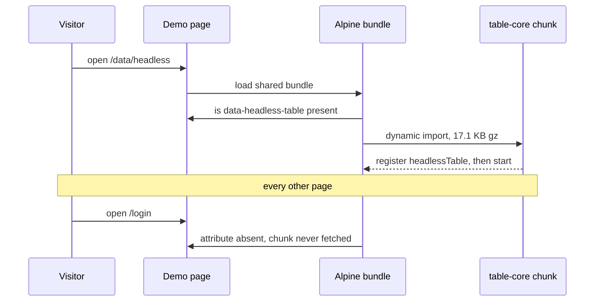
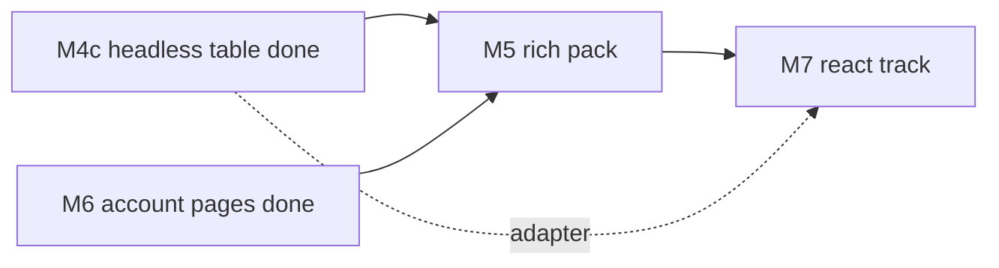

# RFC-001: Completing Clear Admin

|             |               |
| ----------- | ------------- |
| **Version** | v5            |
| **Date**    | 2026-09-12    |
| **Author**  | surdarmaputra |
| **Status**  | Accepted      |
| **Profile** | Frontend only |

### Changelog

| Ver | Date       | Change                                                                                                                                                               | Verdict                 |
| --- | ---------- | -------------------------------------------------------------------------------------------------------------------------------------------------------------------- | ----------------------- |
| v1  | 2026-09-11 | initial                                                                                                                                                              | ⚠️ Feasible with limits |
| v2  | 2026-09-11 | Open questions 2–5 answered. Spreadsheet descoped to cell edit + keyboard nav; M4 10 d → 7 d; total 77 d → 74 d. Status → Accepted.                                  | ⚠️ Feasible with limits |
| v3  | 2026-09-12 | Records the elevation reversal shipped in #3, re-freezes tokens after M3, marks M0–M3 done, and resolves the bundle-budget breach by swapping ApexCharts → Chart.js. | ⚠️ Feasible with limits |
| v4  | 2026-09-12 | M2b and M4 shipped; budget now measured rather than projected. Adds a second, headless table implementation (M4c) and the rule that keeps the two from diverging.    | ⚠️ Feasible with limits |
| v5  | 2026-09-12 | M4c and M6 shipped; the progress components close the one gap M3 left. `table-core` measures 17.1 KB gz against the 9.2 KB v4 projected. One milestone of HTML left. | ⚠️ Feasible with limits |

**v5 diff:** _changed_ — M4c and M6 marked done; progress bar and circle land, so the tracker is 49 of 54; remaining effort 48 d → 44 d; the page budget table is re-measured in this build. _added_ — D10, the dynamic import that keeps `table-core` on one page; a risk row for a dependency estimate that missed by 86%; the headless page's own budget row. _dropped_ — the 9.2 KB gz projection for `table-core`, superseded by the measurement.

---

## 1. TL;DR

- **M4c and M6 shipped** — 34 eng-days done; 49 of 54 HTML items `done` in the tracker.
- **The HTML bundle is one milestone from complete.** M5 — editor, files, kanban — is all that is left of it.
- **`table-core` costs 17.1 KB gz, not the 9.2 KB v4 projected.** It is a dynamic import (D10), so one page pays it.
- Remaining: **~44 eng-days** (9 d HTML + 35 d React `?`).

## 2. Verdict

> ⚠️ **Feasible with limitations** — unchanged. Eight milestones have now shipped on the estimates in this document. What is left is one HTML milestone measured against six that landed, and a React track that is still a guess.

**Flips if:** a second contributor joins → ✅. Drops to ❌ only if the design system is reopened again mid-track — see D6 for the one time it already was.

Limitations:

- **~9 weeks solo remaining** at 5 d/wk, React included.
- **Two bundles, zero shared code** — by design. Every component is built twice.
- **React effort is still an estimate, not a measurement.** 35 d, unchanged since v1, re-estimated at the M7 scaffold and not before.
- **Dependency sizes have now missed twice.** ApexCharts breached the budget by itself (D7); `table-core` came in 86% over its projection. Both were caught by measuring, neither by estimating.
- **Two table implementations now exist**, so every future table feature is a judgement call about where it lands. D9 sets the rule; it is still a standing cost.

## 3. Problem

v2's problem statement is now resolved except for the React bundle:

| v2 said                                          | Today                                                                   |
| ------------------------------------------------ | ----------------------------------------------------------------------- |
| 6 of 53 HTML items done, 0 of 53 React           | 49 of 54 HTML, still 0 React                                            |
| Demo advertises two bundles, one links nowhere   | Unchanged — the React card is still "In progress"                       |
| Deploy is red on `main`, Pages was never enabled | Fixed. Pages deploys from `main`, demo is live                          |
| v3: dashboard over the 250 KB gz budget          | Fixed in M2b. 103.0 KB gz measured in a browser                         |
| v3: tokens rewritten mid-track without an RFC    | Recorded as D6; tokens frozen from M3 under D8                          |
| v4: consumers cannot compare table approaches    | Fixed in M4c. Two pages, each stating when to pick it                   |
| —                                                | **New:** M3 shipped a feedback pack with no progress component (closed) |

## 4. Goals / Non-Goals

Unchanged from v4.

| Goals                                             | Non-Goals                                                        |
| ------------------------------------------------- | ---------------------------------------------------------------- |
| Every milestone ships a **usable page set**       | Vue / Angular / Svelte bundles                                   |
| All items in both bundles                         | npm-published component library                                  |
| HTML and React stay visually identical            | Pixel-identical DOM between bundles                              |
| CI catches design-token drift                     | Full visual-regression suite before the component set stabilises |
| **Every page under 250 KB gz, total transferred** | Redefining the budget as first-paint payload — see D7            |
| Table editing: cell edit + keyboard nav           | Excel-grade spreadsheet (D1)                                     |
| HTML bundle assumes Alpine is present             | No-JS fallbacks (D2)                                             |

## 5. Decisions

D1–D5 stand as written in v2, D6–D8 as in v3, D9 as in v4. v5 adds one.

| #       | Decision                                                                                                                                                     | Consequence                                                                                                                                                                                                                                 |
| ------- | ------------------------------------------------------------------------------------------------------------------------------------------------------------ | ------------------------------------------------------------------------------------------------------------------------------------------------------------------------------------------------------------------------------------------- |
| **D10** | **`table-core` loads by dynamic import, keyed on a `data-headless-table` attribute the page carries.** The shared Alpine bundle never imports it statically. | The headless page transfers 47.7 KB gz; every other page is unchanged but for a 0.6 KB gz preload helper. Registration happens before `Alpine.start()`, because `Alpine.data` registered after it never reaches markup already on the page. |

**Why D10 is a decision and not an implementation note:** the alternative — one `Alpine.data` call next to `serverTable` — is three lines shorter and puts 17.1 KB gz on the login screen. The guard against that is a test asserting the chunk is fetched on `/data/headless` and on no other page.

**What the kill test returned.** D9's exit condition was that the Alpine↔core state adapter must not cost more than the features it unlocks. The core owns its state in atoms and exposes a store, so the adapter is one `store.subscribe` that bumps a counter the getters read — about 5 lines. The remaining ~150 lines of `lib/headless-table.ts` are projection, turning table objects into plain rows the template renders. D9 proceeds: the adapter is cheap, and the projection is what keeps table internals out of Alpine's reactivity.

## 6. Proposed Design

Unchanged: **slice by page, not by component.** HTML fully, then React.

**Stack — no change.** Astro + Alpine + Tailwind v4 + Chart.js (HTML), React 19 + shadcn/Radix + TanStack Router (React). `@tanstack/table-core` is now a real dependency of the HTML bundle, on one page.

### Milestones

| #       | Name                | Ships                                  | Est.    | Status                                |
| ------- | ------------------- | -------------------------------------- | ------- | ------------------------------------- |
| **M0**  | Unblock + guard     | Live demo; CI catches token drift      | 1 d     | ✅ done — `224f94d`                   |
| **M1**  | Auth pack           | Login, Register, Password reset, 404   | 5 d     | ✅ done — `224f94d`                   |
| **M2**  | Dashboard overview  | The flagship screen                    | 8 d     | ✅ done — `224f94d`                   |
| **M3**  | Interaction pack    | CRUD screens buildable                 | 7 d     | ✅ done — `ddd30a5`                   |
| **M4**  | Data pack           | Real admin tables                      | 7 d     | ✅ done — `e8a895d`                   |
| **M2b** | Chart swap (D7)     | Same four charts, 205 KB gz lighter    | 2 d     | ✅ done — `7edab46`                   |
| **M4c** | Headless table (D9) | Same screen on `@tanstack/table-core`  | 2 d     | ✅ done                               |
| **M6**  | Account pages       | Profile, Settings, progress bar/circle | 2 d     | ✅ done                               |
| **M5**  | Rich pack           | Content and file screens               | 9 d     | next — the last HTML milestone        |
|         | **HTML remaining**  |                                        | **9 d** |                                       |
| **M7**  | React track         | Same milestones, same order            | 35 d ?  | scaffold re-estimates before the rest |

M6 ran before M5 rather than after: it composes M1–M3 and nothing else, so it was the cheapest way to take the tracker to 49 of 54 while M5's four new dependencies were still unchosen. The progress bar and circle landed with it — M3 shipped a feedback pack without them, which is the smallest open gap this document has carried.

### Page budget — measured

Transferred bytes per page, `gzip -9`, counted from the requests a browser actually makes (fonts excluded).

| Page                        | v4 reported | Now          |
| --------------------------- | ----------- | ------------ |
| Dashboard — four charts     | 101.6 KB    | **103.0 KB** |
| Headless table (M4c)        | n/a         | **47.7 KB**  |
| Data tables                 | 36.3 KB     | **30.7 KB**  |
| Overlays / feedback / forms | 35.9 KB     | **30.7 KB**  |
| Profile / Settings          | n/a         | **30.7 KB**  |
| Login / register / 404      | 30.5 KB     | **30.6 KB**  |

Chart.js is 61.9 KB gz of the dashboard's total, `table-core` 17.1 KB gz of the headless page's, and both are dynamic imports — a page without a chart or a headless table fetches neither. The non-chart pages measure ~5 KB gz below what v4 reported; nothing in M4c or M6 removes bytes from them, so the difference is in how the two measurements were taken, not in the build. Every page is inside the 250 KB gz ceiling by a factor of 2.4 or better.

## 7. Diagrams

### 7.1 Sequence — what the headless page costs a visitor

Notice the branch: the attribute, not the route, is what decides whether anyone pays for the core.

### 7.2 Flowchart — what is left

The dotted edge is the second reason M4c existed: the Alpine↔core adapter is the pattern M7 needs for `@tanstack/react-table`.

## 8. Alternatives

D9 is settled and shipped. The open choice v5 records is D10 — where the headless core's bytes land.

| Axis                        | A: Dynamic import (D10) | B: Static in shared bundle | C: Separate entry per page | Do nothing (no headless page) |
| --------------------------- | ----------------------- | -------------------------- | -------------------------- | ----------------------------- |
| Build effort                | 0.2 eng-days            | 0                          | 1 eng-day                  | 0                             |
| Ops burden                  | Low — one CI test       | Low                        | Med — two entry points     | Low                           |
| Infra cost                  | $0                      | $0                         | $0                         | $0                            |
| Time to first value         | same day                | same day                   | 1 d                        | shipped                       |
| Blast radius                | Low — one attribute     | Med — every page grows     | Med — build config         | —                             |
| Reversibility               | Easy                    | Easy                       | Hard                       | Easy                          |
| Bytes on pages not using it | **+0.6 KB gz**          | +17.1 KB gz                | +0                         | +0                            |
| **Score → Pick**            | **✅ Winner**           |                            |                            |                               |

Why the losers lost:

- **B** — three lines shorter, and puts `table-core` on the login screen. The budget survives it; the claim that the core is opt-in does not.
- **C** — the only option with literally zero cost elsewhere, but a second Astro entry point for one page is an abstraction with one implementation.
- **Do nothing** — already rejected in v4 as D9. Restated here only because it remains the cheapest world to maintain.

## 9. Risks & Mitigations

| Risk                                                | Likelihood | Impact | Mitigation                                                                                                                                        |
| --------------------------------------------------- | ---------- | ------ | ------------------------------------------------------------------------------------------------------------------------------------------------- |
| **A dependency measures far above its estimate**    | **High**   | Med    | It has happened twice — ApexCharts (D7) and `table-core` (86% over). Measure in a browser before the page is written, never after. M5 adds four.  |
| M5's four dependencies breach the budget together   | Med        | High   | Lexical, a file previewer, a lightbox and SortableJS on one page set. Measure each behind a dynamic import per D10, page by page, not at the end. |
| Design reopened again mid-track                     | Low        | High   | D8 — tokens are frozen from M3. A change is a new version, and D6 is the precedent for what a silent edit costs.                                  |
| Token renamed; stale class compiles to nothing      | Low        | Med    | M0 token guard runs in CI. It caught two false-negative class strings inside the headless page's Alpine expressions during M4c.                   |
| The two table pages drift apart                     | Med        | Med    | D9's rule: the Alpine table is the reference and gets every feature; the headless page only tracks what the core makes materially easier.         |
| Solo maintainer stalls mid-milestone                | Med        | Med    | M5 is the only thing left over 2 d, and it splits cleanly into editor, files and kanban.                                                          |
| HTML/React visual drift                             | Med        | Med    | Shared class contract per component; visual regression added at M7 start.                                                                         |
| React chart library repeats the ApexCharts mistake  | Med        | Med    | Measure before adopting. Recharts with its React runtime bundles to 70.5 KB gz on the same test — acceptable, confirm at M7.                      |
| Nobody is paged — this is a template, not a service | —          | —      | No on-call. Failure mode is a red CI run, not an outage.                                                                                          |

## 10. Cost

| Item             | Amount        | Notes                                                           |
| ---------------- | ------------- | --------------------------------------------------------------- |
| Infra            | **$0/mo**     | GitHub Pages, free tier                                         |
| Licences         | **$0**        | Every dependency in the stack is MIT                            |
| Bundle budget    | ≤250 KB gz    | per page, total transferred; worst page measured at 103.0 KB gz |
| Eng effort HTML  | 9 d           | M5 only                                                         |
| Eng effort React | 35 d ?        | extrapolated — no React code exists yet                         |
| Spent to date    | 34 d          | M0–M4, M2b, M4c and M6, on estimate                             |
| **Total y1**     | **~78 d, $0** | 74 d planned + 2 d chart rework + 2 d M4c                       |

## 11. Rollout

Unchanged mechanics: every phase exits with a deployed demo, rollback is always `git revert` + redeploy.

| Phase | Does                           | Exit criteria                                                       | Rollback         |
| ----- | ------------------------------ | ------------------------------------------------------------------- | ---------------- |
| M0–M4 | Shipped                        | Demo live; tracker at 44 of 53 HTML items                           | —                |
| M2b   | Shipped                        | Dashboard under budget; both palettes pass CVD and contrast         | revert, redeploy |
| M4c   | Shipped                        | Two table pages; core chunk proven absent from every other page     | revert, redeploy |
| M6    | Shipped                        | Profile, Settings, progress bar and circle; tracker at 49 of 54     | revert, redeploy |
| M5a   | Rich text editor               | Lexical measured behind a dynamic import before the page is written | revert, redeploy |
| M5b   | File upload, preview, lightbox | Drag-drop and lightbox keyboard-reachable                           | revert, redeploy |
| M5c   | Kanban                         | HTML bundle **100% complete**; tracker all `done`                   | revert, redeploy |
| M7    | React track, M1–M6 order       | React card on demo goes live; both bundles at parity                | revert, redeploy |

**Cheapest kill test for M5:** import Lexical into a throwaway page and measure it, before any editor UI exists. ApexCharts and `table-core` both cost a rework or a corrected claim because that step came second.

## 12. Measurement

_N/A — not a Growth profile. Progress is `docs/components.md`; CI green plus a live demo page is the only signal needed. The one number tracked here is the per-page gz budget in §6._

## 13. Monetization

_N/A — MIT licensed, no revenue model._

## 14. Open Questions

| #   | Question                                                                                                           | Owner         | Needed by |
| --- | ------------------------------------------------------------------------------------------------------------------ | ------------- | --------- |
| 1   | React effort is extrapolated, not measured. Re-estimate after the M7 scaffold.                                     | surdarmaputra | M7 start  |
| 2   | React chart library — Recharts measures 70.5 KB gz with its runtime. Confirm or swap before porting the dashboard. | surdarmaputra | M7 charts |
| 3   | Does the React bundle need both table approaches, or does `@tanstack/react-table` simply win there?                | surdarmaputra | M7 tables |
| 4   | Lexical, the lightbox and SortableJS are unmeasured. Does M5's page set stay inside 250 KB gz with all three?      | surdarmaputra | M5 start  |
| 5   | Should M5 ship as one milestone or as M5a/M5b/M5c? The rollout splits it; the estimate does not.                   | surdarmaputra | M5 start  |

## 15. Recommendation

- **Do:** M5, the last HTML milestone. Measure each of its four dependencies behind a dynamic import before writing the page that uses it — that is the one process change this version earns.
- **Then:** M7, starting with the scaffold that replaces the 35 d guess with a number.
- **Don't:** start React before M5 closes, and don't let the headless table page grow features the reference page lacks beyond what D9 allows.
- **Revisit when:** the M7 scaffold lands, or M5's dependencies measure over budget — whichever comes first.
