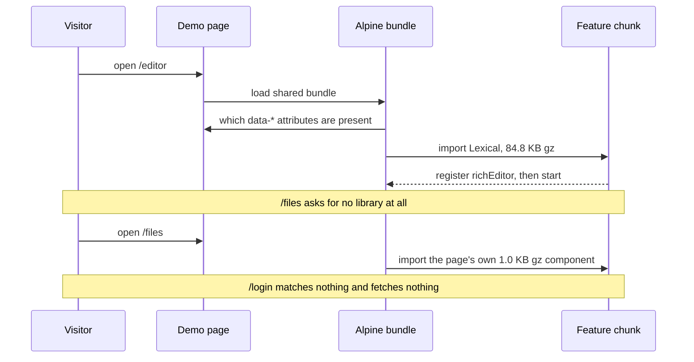
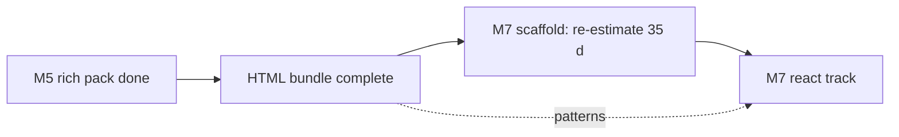

# RFC-001: Completing Clear Admin

|             |               |
| ----------- | ------------- |
| **Version** | v6            |
| **Date**    | 2026-09-13    |
| **Author**  | surdarmaputra |
| **Status**  | Accepted      |
| **Profile** | Frontend only |

### Changelog

| Ver | Date       | Change                                                                                                                                                                      | Verdict                 |
| --- | ---------- | --------------------------------------------------------------------------------------------------------------------------------------------------------------------------- | ----------------------- |
| v1  | 2026-09-11 | initial                                                                                                                                                                     | ⚠️ Feasible with limits |
| v2  | 2026-09-11 | Open questions 2–5 answered. Spreadsheet descoped to cell edit + keyboard nav; M4 10 d → 7 d; total 77 d → 74 d. Status → Accepted.                                         | ⚠️ Feasible with limits |
| v3  | 2026-09-12 | Records the elevation reversal shipped in #3, re-freezes tokens after M3, marks M0–M3 done, and resolves the bundle-budget breach by swapping ApexCharts → Chart.js.        | ⚠️ Feasible with limits |
| v4  | 2026-09-12 | M2b and M4 shipped; budget now measured rather than projected. Adds a second, headless table implementation (M4c) and the rule that keeps the two from diverging.           | ⚠️ Feasible with limits |
| v5  | 2026-09-12 | M4c and M6 shipped; the progress components close the one gap M3 left. `table-core` measures 17.1 KB gz against the 9.2 KB v4 projected. One milestone of HTML left.        | ⚠️ Feasible with limits |
| v6  | 2026-09-13 | **M5 shipped — the HTML bundle is complete.** Q4 and Q5 answered by measurement. Adds D11, the lightbox with no dependency. Corrects the tracker count v5 reported wrongly. | ⚠️ Feasible with limits |

**v6 diff:** _changed_ — M5 marked done and the HTML track closed at 0 d remaining; the page budget is re-measured in this build, with `/editor` replacing the dashboard as the worst page; the tracker reads 62 of 62 rather than v5's "49 of 54", a count that was wrong twice over. _added_ — D11, the hand-rolled lightbox; §5.1, what Q4's kill test returned before any M5 page was written; a risk row for the editor page's share of the budget. _dropped_ — Q4 and Q5, both answered; the two dead sidebar links (`/data/spreadsheet`, `/components/charts`) that pointed at pages this plan never intended to build.

---

## 1. TL;DR

- **M5 shipped, so the HTML bundle is done.** 43 eng-days spent; every row in the tracker is `done`.
- **Q4 is answered by measurement, not projection.** Lexical, SortableJS and a lightbox library were all measured before a page was written — and one of the three was then not adopted.
- **Q5 is answered: one milestone, three slices, shipped together.** M5a/M5b/M5c were sequencing, not separate deliveries.
- Remaining: **~35 eng-days**, all React, all still an estimate.

## 2. Verdict

> ⚠️ **Feasible with limitations** — unchanged, and for exactly one reason now. Nine milestones have shipped on the estimates in this document. What remains is a React track that has never been measured.

**Flips if:** a second contributor joins → ✅. Drops to ❌ only if the design system is reopened mid-track — see D6 for the one time it already was.

Limitations:

- **~7 weeks solo remaining** at 5 d/wk, all of it React.
- **Two bundles, zero shared code** — by design. Every component is built twice, and the second build has not started.
- **React effort is still an estimate, not a measurement.** 35 d, unchanged since v1, re-estimated at the M7 scaffold and not before.
- **Dependency sizes missed twice before this milestone and none in it.** ApexCharts breached the budget by itself (D7) and `table-core` came in 86% over (v5) — both estimated. Every M5 dependency was measured first, and every one landed where the measurement said.
- **Two table implementations exist**, so every future table feature is a judgement call about where it lands. D9 sets the rule; it is still a standing cost.

## 3. Problem

v2's problem statement is now resolved except for the React bundle:

| v2 said                                          | Today                                                                         |
| ------------------------------------------------ | ----------------------------------------------------------------------------- |
| 6 of 53 HTML items done, 0 of 53 React           | **62 of 62 HTML**, still 0 React                                              |
| Demo advertises two bundles, one links nowhere   | Unchanged — the React card is still "In progress"                             |
| Deploy is red on `main`, Pages was never enabled | Fixed. Pages deploys from `main`, demo is live                                |
| v3: dashboard over the 250 KB gz budget          | Fixed in M2b. 103.8 KB gz measured in a browser                               |
| v3: tokens rewritten mid-track without an RFC    | Recorded as D6; tokens frozen from M3 under D8                                |
| v4: consumers cannot compare table approaches    | Fixed in M4c. Two pages, each stating when to pick it                         |
| v5: M3 shipped a feedback pack with no progress  | Fixed in M6                                                                   |
| —                                                | **New:** two sidebar links pointed at pages this plan never intended to build |

**The tracker count v5 reported was wrong.** v5 said "49 of 54". The tracker held 59 rows at that commit, 54 of them `done` — so the figure was both the wrong numerator and the wrong denominator, off in a direction that flattered the project. M5's three pages take it to 62 rows, all `done`. The count in this document is now produced by reading the file, not by hand.

## 4. Goals / Non-Goals

Unchanged from v4.

| Goals                                             | Non-Goals                                                        |
| ------------------------------------------------- | ---------------------------------------------------------------- |
| Every milestone ships a **usable page set**       | Vue / Angular / Svelte bundles                                   |
| All items in both bundles                         | npm-published component library                                  |
| HTML and React stay visually identical            | Pixel-identical DOM between bundles                              |
| CI catches design-token drift                     | Full visual-regression suite before the component set stabilises |
| **Every page under 250 KB gz, total transferred** | Redefining the budget as first-paint payload — see D7            |
| Table editing: cell edit + keyboard nav           | Excel-grade spreadsheet (D1)                                     |
| HTML bundle assumes Alpine is present             | No-JS fallbacks (D2)                                             |

## 5. Decisions

D1–D5 stand as written in v2, D6–D8 as in v3, D9 as in v4, D10 as in v5. v6 adds one.

| #       | Decision                                                                                                                                                              | Consequence                                                                                                                                                                                                     |
| ------- | --------------------------------------------------------------------------------------------------------------------------------------------------------------------- | --------------------------------------------------------------------------------------------------------------------------------------------------------------------------------------------------------------- |
| **D11** | **The lightbox is built on the overlay store and `x-focus-trap` this bundle already ships, not on a library.** PhotoSwipe was measured at 17.0 KB gz and not adopted. | The files page transfers 34.0 KB gz — 2.5 KB above the plain-page baseline, for upload, preview, gallery and lightbox together. The cost is that zoom, pinch and swipe gestures are not there and are not free. |

**Why D11 is a decision and not an implementation note:** the alternative is one import and a 17.0 KB gz chunk, and it buys gestures a mouse-and-keyboard admin template does not use. The primitives it would replace — a dialog over one overlay store, Escape and arrow keys, a focus trap — shipped in M3 and are already under test. Adopting a second modal system to show an image would leave the bundle with two.

### 5.1 What Q4's kill test returned

Every M5 dependency was bundled and gzipped before a page existed, which is the process change v5 asked for. The numbers:

| Dependency                                               | Measured, alone | Shipped as | Note                                                                                                                                        |
| -------------------------------------------------------- | --------------- | ---------- | ------------------------------------------------------------------------------------------------------------------------------------------- |
| Lexical — core, rich-text, history, list, link, markdown | 128.1 KB gz     | 84.8 KB gz | Naming the nine transformers the toolbar has buttons for, instead of importing `TRANSFORMERS`, drops `@lexical/code` and 43.3 KB gz with it |
| SortableJS                                               | 12.6 KB gz      | 13.1 KB gz | The modular build saves 0.4 KB gz and loses its types; not worth it                                                                         |
| PhotoSwipe                                               | 17.0 KB gz      | —          | Not adopted — D11                                                                                                                           |

The answer to Q4 is therefore yes, with room: the heaviest M5 page transfers 116.5 KB gz against a 250 KB gz ceiling. The answer would have been "yes, barely" had `TRANSFORMERS` been imported without looking at what is in it.

## 6. Proposed Design

Unchanged: **slice by page, not by component.** HTML fully, then React.

**Stack — no change.** Astro + Alpine + Tailwind v4 + Chart.js (HTML), React 19 + shadcn/Radix + TanStack Router (React). Lexical and SortableJS join `@tanstack/table-core` as real dependencies of the HTML bundle, each on one page and each behind a dynamic import (D10).

### Milestones

| #       | Name                | Ships                                  | Est.    | Status                                |
| ------- | ------------------- | -------------------------------------- | ------- | ------------------------------------- |
| **M0**  | Unblock + guard     | Live demo; CI catches token drift      | 1 d     | ✅ done — `224f94d`                   |
| **M1**  | Auth pack           | Login, Register, Password reset, 404   | 5 d     | ✅ done — `224f94d`                   |
| **M2**  | Dashboard overview  | The flagship screen                    | 8 d     | ✅ done — `224f94d`                   |
| **M3**  | Interaction pack    | CRUD screens buildable                 | 7 d     | ✅ done — `ddd30a5`                   |
| **M4**  | Data pack           | Real admin tables                      | 7 d     | ✅ done — `e8a895d`                   |
| **M2b** | Chart swap (D7)     | Same four charts, 205 KB gz lighter    | 2 d     | ✅ done — `7edab46`                   |
| **M4c** | Headless table (D9) | Same screen on `@tanstack/table-core`  | 2 d     | ✅ done — `ce9a20a`                   |
| **M6**  | Account pages       | Profile, Settings, progress bar/circle | 2 d     | ✅ done — `ce9a20a`                   |
| **M5**  | Rich pack           | Editor, files, kanban                  | 9 d     | ✅ done                               |
|         | **HTML remaining**  |                                        | **0 d** | The bundle is complete                |
| **M7**  | React track         | Same milestones, same order            | 35 d ?  | scaffold re-estimates before the rest |

**Q5 — one milestone or three?** One. M5a, M5b and M5c were the order the work was done in, not three things to deliver separately: they share no code, but they share the dynamic-import wiring, the tracker update and the budget re-measurement, and splitting the delivery would have paid that cost three times. The rollout table below keeps the three exit criteria, because those are per-page and worth checking separately.

### Page budget — measured

Transferred bytes per page, `gzip -9`, counted from the requests a browser actually makes (fonts excluded). The Playwright suite asserts the ceiling on six of these, so a dependency cannot breach it quietly.

| Page                        | v5 reported | Now          |
| --------------------------- | ----------- | ------------ |
| Editor (M5a)                | n/a         | **116.5 KB** |
| Dashboard — four charts     | 103.0 KB    | **103.8 KB** |
| Headless table (M4c)        | 47.7 KB     | **48.6 KB**  |
| Kanban (M5c)                | n/a         | **44.6 KB**  |
| Files (M5b)                 | n/a         | **34.0 KB**  |
| Data tables                 | 30.7 KB     | **31.5 KB**  |
| Overlays / feedback / forms | 30.7 KB     | **31.5 KB**  |
| Profile / Settings          | 30.7 KB     | **31.5 KB**  |
| Login / register / 404      | 30.6 KB     | **31.4 KB**  |

Lexical is 84.8 KB gz of the editor page's total, Chart.js 61.7 KB gz of the dashboard's, `table-core` 17.0 KB gz of the headless page's and SortableJS 13.1 KB gz of the kanban page's — every one a dynamic import, so a page that needs none fetches none. The plain-page baseline rose 0.8 KB gz, which is the stylesheet growing to cover three new pages; it is one file every page shares, so the whole set moves together. The worst page is inside the ceiling by a factor of 2.1.

## 7. Diagrams

### 7.1 Sequence — what decides whether a visitor pays for a dependency

The branch is on the attribute, not the route — and the files page shows the case where the chunk carries no dependency, only the page's own code.

### 7.2 Flowchart — what is left

The dotted edge is the whole argument for having built HTML first: nine milestones of decisions — what each page contains, which dependency won, where the bytes go — are inputs to the React track rather than questions it has to reopen.

## 8. Alternatives

D11 is the choice this version records: where the lightbox comes from.

| Axis                | A: Hand-rolled on M3 primitives (D11) | B: PhotoSwipe                 | C: Native `<dialog>` + CSS only | Do nothing (no lightbox) |
| ------------------- | ------------------------------------- | ----------------------------- | ------------------------------- | ------------------------ |
| Build effort        | 0.3 eng-days                          | 0.2 eng-days                  | 0.4 eng-days                    | 0                        |
| Ops burden          | Low                                   | Low — one more dep            | Low                             | None                     |
| Infra cost          | $0                                    | $0                            | $0                              | $0                       |
| Time to first value | same day                              | same day                      | same day                        | —                        |
| Blast radius        | Low — one page                        | Med — a second overlay system | Low                             | —                        |
| Reversibility       | Easy                                  | Easy                          | Easy                            | Easy                     |
| Bytes on that page  | **+0 KB gz**                          | +17.0 KB gz                   | +0 KB gz                        | +0                       |
| Gestures            | None                                  | Pinch, swipe, zoom            | None                            | —                        |
| **Score → Pick**    | **✅ Winner**                         |                               |                                 |                          |

Why the losers lost:

- **B** — the gestures are real and this template does not use them. It also brings a second focus-trap and Escape-key implementation into a bundle that already has one under test.
- **C** — `<dialog>` would replace the overlay store's body-scroll lock and the focus trap with browser behaviour, which is tempting, but only on this one page. Two overlay mechanisms for one page set is the same objection as B.
- **Do nothing** — a file manager that cannot show the file it just accepted is the gap M5b exists to close.

## 9. Risks & Mitigations

| Risk                                                | Likelihood | Impact | Mitigation                                                                                                                                                                                                                |
| --------------------------------------------------- | ---------- | ------ | ------------------------------------------------------------------------------------------------------------------------------------------------------------------------------------------------------------------------- |
| **A dependency measures far above its estimate**    | Low        | Med    | Was High. It happened twice by estimating and zero times in M5, where every candidate was bundled and gzipped first. The rule now has a milestone behind it.                                                              |
| The editor page is the budget's new worst case      | Med        | Med    | 116.5 KB gz, 84.8 of it Lexical. A tenth transformer is a measurable decision, not a free one; the Playwright budget test fails the build before a breach ships.                                                          |
| Design reopened again mid-track                     | Low        | High   | D8 — tokens are frozen from M3. A change is a new version, and D6 is the precedent for what a silent edit costs.                                                                                                          |
| Token renamed; stale class compiles to nothing      | Low        | Med    | M0 token guard runs in CI. In M5 it rejected four quoted literals in bound class expressions that were not class names — which is what moved the editor toolbar onto `aria-pressed` variants and off conditional classes. |
| The two table pages drift apart                     | Med        | Med    | D9's rule: the Alpine table is the reference and gets every feature; the headless page only tracks what the core makes materially easier.                                                                                 |
| Library and framework fight over the same DOM       | Med        | Med    | SortableJS never keeps its move — the node is put back and the board re-renders from state. One test asserts a dragged card exists exactly once afterwards.                                                               |
| HTML/React visual drift                             | Med        | Med    | Shared class contract per component; visual regression added at M7 start.                                                                                                                                                 |
| React chart library repeats the ApexCharts mistake  | Med        | Med    | Measure before adopting. Recharts with its React runtime bundles to 70.5 KB gz on the same test — acceptable, confirm at M7.                                                                                              |
| Nobody is paged — this is a template, not a service | —          | —      | No on-call. Failure mode is a red CI run, not an outage.                                                                                                                                                                  |

## 10. Cost

| Item             | Amount        | Notes                                                           |
| ---------------- | ------------- | --------------------------------------------------------------- |
| Infra            | **$0/mo**     | GitHub Pages, free tier                                         |
| Licences         | **$0**        | Every dependency in the stack is MIT                            |
| Bundle budget    | ≤250 KB gz    | per page, total transferred; worst page measured at 116.5 KB gz |
| Eng effort HTML  | **0 d**       | Complete                                                        |
| Eng effort React | 35 d ?        | extrapolated — no React code exists yet                         |
| Spent to date    | 43 d          | M0–M6, on estimate, every milestone                             |
| **Total y1**     | **~78 d, $0** | 74 d planned + 2 d chart rework + 2 d M4c                       |

## 11. Rollout

Unchanged mechanics: every phase exits with a deployed demo, rollback is always `git revert` + redeploy.

| Phase | Does                                | Exit criteria                                                      | Rollback         |
| ----- | ----------------------------------- | ------------------------------------------------------------------ | ---------------- |
| M0–M4 | Shipped                             | Demo live; tracker at 44 of 53 HTML items                          | —                |
| M2b   | Shipped                             | Dashboard under budget; both palettes pass CVD and contrast        | revert, redeploy |
| M4c   | Shipped                             | Two table pages; core chunk proven absent from every other page    | revert, redeploy |
| M6    | Shipped                             | Profile, Settings, progress bar and circle                         | revert, redeploy |
| M5a   | Shipped — rich text editor          | Lexical measured before the page was written; markdown round-trips | revert, redeploy |
| M5b   | Shipped — upload, preview, lightbox | Drop zone reachable by keyboard; lightbox walks with arrow keys    | revert, redeploy |
| M5c   | Shipped — kanban                    | Drag and keyboard both move a card; **tracker all `done`**         | revert, redeploy |
| M7    | React track, M1–M6 order            | React card on demo goes live; both bundles at parity               | revert, redeploy |

**Cheapest kill test for M7:** scaffold the React app with the router and one page, and measure the baseline before porting anything. The HTML baseline is 31.4 KB gz per plain page; if React's is four times that, the 250 KB ceiling is the thing to revisit, not the port.

## 12. Measurement

_N/A — not a Growth profile. Progress is `docs/components.md`; CI green plus a live demo page is the only signal needed. The per-page gz budget in §6 is now asserted by the test suite rather than only reported here._

## 13. Monetization

_N/A — MIT licensed, no revenue model._

## 14. Open Questions

| #   | Question                                                                                                           | Owner         | Needed by |
| --- | ------------------------------------------------------------------------------------------------------------------ | ------------- | --------- |
| 1   | React effort is extrapolated, not measured. Re-estimate after the M7 scaffold.                                     | surdarmaputra | M7 start  |
| 2   | React chart library — Recharts measures 70.5 KB gz with its runtime. Confirm or swap before porting the dashboard. | surdarmaputra | M7 charts |
| 3   | Does the React bundle need both table approaches, or does `@tanstack/react-table` simply win there?                | surdarmaputra | M7 tables |

v5's Q4 and Q5 are closed: §5.1 holds the measurements, and M5 shipped as one milestone.

## 15. Recommendation

- **Do:** M7's scaffold, and nothing else of React until it has produced a number to replace the 35 d guess.
- **Then:** the React track in M1–M6 order, measuring each dependency before the page that uses it — the one process change v5 earned and M5 confirmed.
- **Don't:** add features to the HTML bundle while the React one is empty. A second bundle at parity is worth more than a first bundle with more in it.
- **Revisit when:** the M7 scaffold lands, or a React dependency measures over budget — whichever comes first.
